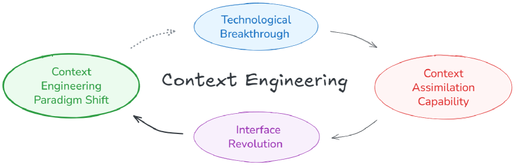

# 一、引言：让机器真正理解“语境”
在大模型和智能体快速发展的今天，我们越来越频繁地谈到“上下文长度”“记忆窗口”“语义保持”等问题。  
但在这些技术术语背后，真正的问题其实只有一个——**机器究竟理解“语境”了吗？**

上下文工程（Context Engineering）可以被看作是一个“信息熵降低”的过程。  
与人类不同，机器在交流中无法自动“填补信息差”。人类能够依靠共享知识、情感线索和上下文感知来主动降低信息熵。而目前的智能体缺乏这种能力。因此，我们必须对上下文进行“预处理”，将原始信息压缩成它们能够理解的形式。这就是上下文工程的核心价值：将高熵的上下文和意图转化为智能体能够理解的低熵表示。  
因此，**上下文工程的任务，就是帮助智能体完成这种主动降熵——将复杂的语境压缩为可理解的形式。**

换句话说，**上下文工程是让智能体理解人类意图的桥梁。**

# 二、理论框架：定义与范式跃迁

## 2.1 定义：系统化的语境优化过程

上下文工程的定义非常明确：

> 上下文工程是一种系统化的过程，旨在设计和优化上下文的采集、存储、管理和使用，以增强智能体的理解能力和任务执行表现。

它包含四个核心环节：
1. **采集（Collection）** —— 捕获与任务相关的上下文信息；  
2. **存储（Storage）** —— 将信息以可重用的形式保存；  
3. **管理（Management）** —— 对上下文进行组织、过滤与抽象；  
4. **使用（Usage）** —— 在推理、协作和交互中调用上下文。  

目标是让智能体在不确定环境中保持理解的连续性、记忆的有效性和决策的稳定性。

## 2.2 范式迁移：智能跃迁驱动的界面革命

> 技术的突破会带来上下文同化能力的跃升，而这种跃升会引发交互界面的革命，并最终推动上下文工程的范式转变。

换句话说，**每一次智能能力的提升，都会带来“上下文理解方式”的进化**。  
从最早的传感器驱动系统，到现在的语义型智能体，我们正在经历一场从“数据上下文”到“语义上下文”的转变。

# 三、历史演进：从 Context Engineering 1.0 到 2.0

## 3.1 Context Engineering 1.0：以人为中心的感知式系统

在 20 世纪末，Anind Dey 与 Salber 等人提出了著名的 **Context Toolkit**，这被视为“上下文工程 1.0”的标志。

上下文工程 1.0 围绕五个核心抽象展开：**Widgets、Interpreters、Aggregators、Services 和 Discoverers。**  
- Widgets 封装了传感器并提供标准接口；  
- Interpreters 从原始数据中提取高层语义；  
- Aggregators 负责整合多源上下文；  
- Services 提供应用层对上下文功能的访问；  
- Discoverers 负责上下文组件的动态注册与发现。  

这种分层结构为可扩展、自适应的上下文系统奠定了基础。

1.0 时代的上下文工程主要服务于**普适计算（Ubiquitous Computing）**与**人机交互（HCI）**。它强调的是人类适应机器：设计者扮演着 “意图翻译者”的角色，将复杂的人类意图转化为结构化的、机器可读的格式。它让机器能够感知环境，但无法真正做到理解人类语义。

虽然表达能力与可扩展性有限，但 1.0 阶段的研究奠定了后续语义型架构的理论与实践基础。

## 3.2 Context Engineering 2.0：以智能体为核心的语义系统

当机器具备了大规模语言建模与多模态理解能力后，**上下文工程进入 2.0 时代**。  
这一阶段的核心特征是：从“触发”转向“理解”，从“响应” 转向“协作”。旨在主动解读用户正在做什么，并与用户协作以实现共同目标。

例如，当您撰写研究论文时，系统可以分析您之前的段落和当前的写作意图，从而建议合适的下一节。它不仅感知您的环境，而且还融入到您的工作流程中。这就是我们所说的上下文协作；我们从上下文感知系统发展到上下文协作系统。

为了提高复杂环境下的协作能力，上下文信息收集和存储能力的需求也日益增长。当前存储方式和载体多种多样，每种存储方式在延迟、容量、可扩展性和安全性方面各有优劣。然而，无论采用何种存储方式，对上下文信息的存储都应始终遵循两条核心原则：

- **最小充分原则（Minimal Sufficiency Principle）**：  
系统应只采集和存储完成任务所必需的信息。上下文的价值不在于数量，而在于“刚好够用”。  

- **语义连续原则（Semantic Continuity Principle）**：  
上下文存在的意义在于维持语义的连贯性，而非数据的连续性。

这两条原则揭示了上下文工程 2.0 的核心哲学：**追求语义连续，而非信息堆叠。**

# 四、上下文管理（Context Management）

上下文管理是“如何组织、抽象与维护语境”的过程，它决定了系统能否在复杂任务中保持稳定的理解与记忆。

## 4.1 上下文处理方案

上下文工程的核心在于处理而非收集。精心设计的处理方法是后续所有环节的基础，它使系统能专注于关键信息并构建可持续的理解。本节旨在回答一个核心问题：如何处理原始上下文才能获得最佳结果？我们将超越简单存储，探讨几种常用方案的优缺点。

- **按照时间序列**：
  
  为每条信息附加时间戳，以保留其生成顺序，按时间组织交互记录。但时间戳只能保留时间顺序，而缺乏语义结构，导致模型难以捕捉长程依赖并高效检索信息；同时，交互序列的线性增长也引发了存储和推理的可扩展性问题。

- **按照功能/语义**：
  
  每个条目明确标注功能角色（例如“目标”、“决策”和“行动”）来组织上下文信息，从而使每个条目更易于理解。虽然这有助于说明每条信息的含义，但它可能略显僵化，并可能限制更灵活的推理或创造性的综合。

- **问答式压缩（QA Compression）**：
  
  将长文本转化为问答对，这和 RAG 中的假设性问题生成的技巧相似，在搜索引擎或基于 FAQ 的系统等应用中能显著提高检索效率。但这种方式会打乱原有的上下文结构，不适合需要全面理解上下文的任务，例如总结或推理。

- **层级笔记结构**：
  
  采用树状信息组织，将信息组织成树状结构，其中宽泛的概念分支成越来越具体的子要点，GraghRAG 便是采用了这种思路。但这种组织方式难以表达观点之间的逻辑联系。诸如因果关系或证据与结论之类的关系往往无法体现。也无法捕捉理解随时间演变的过程，例如，当出现新的见解或现有观点被修正。

## 4.2 多模态融合与层级记忆

上下文信息正日益多模态化，涵盖文本、图像、音频、视频、代码、传感器数据乃至环境状态。在与真实或模拟环境交互时，机器需将跨模态信息整合为统一连贯的表示，而非孤立处理各类信息。核心挑战在于模态间的异质性——它们在结构、信息密度和时间动态上存在显著差异。如何对这些异质信息进行联合编码、比较与推理？在 2.0 时代，我们总结出以下几种常见策略：

- **统一向量空间表示**：
  
  每种模态首先由其自身的编码器进行处理。由于这些向量最初存在于具有不同统计特性的独立表示空间中，因此每个向量随后都会经过一个学习过的投影层，该投影层将其映射到一个固定维度的共享向量空间。

- **多模态特征向量关联**
  
    - 多模态统一注意力机制
        
        将不同模态的表示在共享的嵌入空间中融合后，输入至同一Transformer架构，通过自注意力机制实现所有模态 token 之间的全域交互与深度融合。

    - 多模态交叉注意力机制
        
        以一种模态的特征作为查询，另一种模态的特征作为键与值，通过交叉注意力实现跨模态的定向检索与交互，支持灵活的目标导向型多模态推理。

## 4.3 分层记忆架构

正如 Andrej Karpathy 所说，LLM 可以通过操作系统类比来理解：模型就像 CPU，而其上下文窗口则类似于 RAM——快速但容量有限的工作内存。正如操作系统决定将哪些数据加载到 RAM 中一样，上下文工程决定了哪些信息应该进入窗口以进行有效推理。

人工智能架构可以从基于时间相关性和重要性将内存划分为不同层级中获益。这种分层方法使系统能够快速访问最近相关的信息，同时将有价值的知识保存在更稳定、更长期的存储中。

- **短期缓存（Short-Term Cache）**：
  
  由处理功能选择的具有高度时间相关性的上下文子集。通常采用 FIFO 或 LRU 策略进行管理。

- **长期存储（Long-Term Storage）**：
  
  经过处理和抽象的、具有高度重要性的上下文子集。如用户偏好、任务状态、长期记忆等。这一层级的上下文通常采用向量数据库或文件存储，支持高效的检索与更新。

- **抽象层（Abstraction Layer）**：
  
  短期记忆向长期记忆的转换。即短期记忆中频繁访问或极其重要的信息被处理并成为长期记忆的一部分。迁移过程受重复频率、情感意义以及与现有知识结构的关联性等因素的影响。

## 4.4 上下文隔离

随着多代理智能体系统的出现，一个关键问题是“上下文污染”。如何进行多代理之间的上下文隔离，避免不同代理之间的信息干扰与冲突成为构建多代理智能体系统的重要挑战。

- **subagent**
  
  subagent 提供了一种绕过上下文限制的替代方案，同时降低了上下文污染的风险，在 Claude Code 系统中广泛应用。每个 subagent 都是一个专业的 AI 助手，拥有独立的上下文窗口、自定义系统提示和受限的工具权限。当某个任务与某个 subagent 的专长相匹配时，主系统可以将其委托给该 subagent，subagent 随后独立运行，而不会污染对话的主要上下文。这一原则可以通过沿功能维度（例如，分析、执行、验证）或层级（例如，规划、实施、审查）进行分离来应用于上下文选择，其中每个独立的 subagent 仅获得履行其特定职责所需的最低权限，从而提高系统的可靠性和可解释性。

- **沙箱环境隔离**
  
    上下文隔离通常依赖于将大量信息存储在外部，并在模型窗口中仅公开轻量级引用。在 HuggingFace 的 CodeAgent 中使用的沙箱方法中，庞大的输出存储在单独的沙箱中，仅在需要时才检索。这样，模型仅与简洁的引用交互，而沙箱则保存完整数据并按需提供。

## 4.5 上下文抽象
原始上下文信息，例如对话轮次、工具输出和检索到的文档，会迅速积累。如果不加以处理，不断增长的历史记录会很快使系统不堪重负，难以识别哪些信息对未来的推理或决策真正重要。为了解决这个问题，可扩展智能体的一项关键能力是上下文抽象 ：将原始上下文转换为更紧凑、结构化的表示。

- **分层内存架构**：
  
  分层记忆通过在不同抽象层次上组织信息，提供了一种管理不断增长的上下文的原则性方法。随着上下文量的增加，这些原始信息会逐步被概括为更抽象的表示，然后传递到下一层。详细实现方案可参照：短期记忆，长期记忆，抽象层。

- **自然语言摘要**：
    
  系统以原始的非结构化形式存储完整的上下文。此外，它会定期生成摘要，提供对已发生事件的精简概览。随着摘要数量的增长，系统可以应用多级摘要（将较早的摘要汇总成更高级别的概述），或者使用特定策略，根据时间或重要性删除不太有用的摘要。这些摘要有助于系统专注于关键信息，同时在需要时仍可获取完整细节。
  
  这种方法简单灵活。但摘要只是纯文本，缺乏结构。这使得系统难以理解事件之间的联系，也难以对上下文进行更深入的推理。

- **提取关键事实**：
    
  系统不仅存储原始上下文，还将关键信息提取成预定义的格式，以便于访问和推理。模式可以采用不同的形式：它可以是实体映射，将关键实体（例如人、物品或地点）表示为节点。每个节点维护实体的属性（例如名称、类型）、当前状态（例如位置、状态）以及与其他实体的链接（例如“拥有”、“与……合作”、“位于……”），GraghRAG 的设计理念与其相似。

- **信息向量化**

  将信息进行向量化，存储在向量数据库中，这些向量反映了输入的含义。这些向量是可压缩的，从而可以构建多级（分层）记忆，以抽象不同尺度的上下文。

# 五、上下文使用（Context Usage）

如果说“管理”解决了如何储存语境的问题，那么“使用”解决的就是——**如何让语境活起来**。

## 5.1 系统内部的上下文共享

现在通用智能应用通常包含多个智能体，每个智能体负责工作流程的一部分。多智能体系统之所以有效，一个原因是它们使用了比单个智能体更多的 token，从而有效地扩展了整个应用的能力。在这样的系统中，一个关键挑战随之而来：多个智能体如何共享上下文以实现连贯的协作行为？与单智能体提示词技巧不同，多智能体系统需要清晰且结构化的方式来在智能体之间传递信息。

- **提示词嵌入**：
  
  这种方式在目前 workflow 形式的应用中非常常见，其方法通过将前一个上下文直接包含在下一个代理的输入提示中来传递信息。

- **结构化信息交换**：

  智能体之间通过交换结构化消息进行通信，这些消息采用固定格式。这些消息通常遵循预定义的模式，例如 JSON 或 XML，并包含必要的字段，如任务类型、输入数据、输出结果和推理步骤等。

- **共享内存通信**

  智能体通常通过读写共享内存空间进行间接通信，该共享内存空间可以实现为集中式外部存储，也可以实现为单个智能体内存中的公共区域。智能体不直接发送消息，而是将信息留在共享空间中（通常以内存块的形式组织），并在之后检查以获取更新。

## 5.2 跨系统上下文互通

与在系统内部共享上下文不同，不同系统的规模和功能有所不同，它们各自在其边界内管理信息。跨系统共享上下文使得这些不同的实体能够访问或交换相关信息，从而实现更好的协调或推理。

- **Adapter 转换层**：不同系统通过格式转换实现互操作；  
- **统一 Schema 或 API 协议**：定义共享上下文接口或协议，如 MCP，A2A，Skill 等协议；
- **混合语义表示**：通过将上下文处理成自然语言摘要或向量检索，平衡可解释性与计算效率 airweave 这个框架就通过向量化的实现了多系统融合知识库的管理，理念与其相似。  

## 5.3 上下文选择

扩展了上下文窗口，系统最终输出的质量仍然受限于用户或是中间环节输入的质量。一个所有开发者都会面临的问题：当前步骤应该选择可用上下文的哪个子集？上下文可能来源于草稿纸、记忆、工具定义或通过 RAG 检索的知识，但并非所有上下文都有用。无关或嘈杂的记忆片段会分散推理注意力或增加推理成本。

经验表明，当上下文窗口的填充度超过约 50%时，人工智能的编码性能通常会下降，这表明过多的上下文和过少的上下文都会降低其有效性。如果没有强大的过滤机制，智能体可能会被自身的记忆所淹没，这是一种现代形式的“上下文过载”。因此，有效的上下文选择成为一种先于注意力的关注 —— 选择哪些内容值得关注。

- **语义相关**：
  
  基于向量的检索来实现，根据上下文的语义相似度来选择相关的上下文片段。这是目前最常用的方法之一，同样也是最有效的方法之一。

- **时序衰减**：
  
  使用过或经常访问的项目更有可能再次被检索。基于这一理念，通常会赋予较新的记忆条目更高的优先级，并逐渐降低较旧条目的优先级，从而使过时的信息自然而然地变得不那么重要。反复访问的条目会积累更高的重要性，确保常用信息始终易于获取。

- **逻辑依赖**：
  
  逻辑依赖是指当前任务直接依赖于先前步骤产生的信息，例如先前的规划决策、工具输出或推理链。这要求系统在选择上下文时，考虑到当前任务的需求和先前步骤的结果。

- **重叠信息**：
  
  如果多条信息表达相同的含义，则可以过滤掉较旧或不太详细的信息。需要系统不仅被动地检测相似性，而且主动决定何时合并、更新或删除冗余条目，以维护简洁且相关的内存池。这与 mem0 实现无限上下文的机制相似。

- **用户偏好和反馈**：
  
  追踪用户与信息的交互方式，并利用这些信息来调整记忆条目的重要性或权重。

- **过滤策略**

  RAG 将源数据分割成易于管理的块，可以通过简单的策略（例如固定行或标记窗口）或更结构化的方法（例如基于抽象语法树 (AST) 的分割）来实现。也可以通过正则表达式匹配这类质朴的方式。面对结构化信息时，使用知识图谱，利用实体和依赖关系等。

## 上下文演化：主动推理
目前大多数上下文应用都是被动的，但用户往往难以（或不合理地）充分表达自身的需求和偏好。为了弥合这一差距，上下文工程应使智能体能够主动行动：推断用户未明确表达的潜在需求、偏好和目标，并据此发起有益的交互。在 2​​.0 时代，我们识别出几种常见的主动偏好挖掘形式：

- **学习和适应用户偏好**：
  
  通过分析对话历史和存储的个人数据（例如用户文档、笔记和过往互动）来学习和适应用户偏好，从而识别沟通风格、兴趣和决策方式的模式。在许多情况下，这些洞察会被整合到不断演进的用户画像中，从而指导更加个性化的互动。甚至可以主动探索用户偏好，例如直接询问用户的喜好或在对话中提供多个选项以收集明确的反馈。

- **从相关问题推断隐藏目标**：
  
  分析用户查询序列来推断隐藏目标。例如，如果用户先询问 Python 装饰器，然后又询问性能调优，这可能反映了用户更深层次的目标，即提高系统运行效率。依据推理出的深层次目标，来预测用户的潜在需求，提供更具目标导向性的帮助。

- **根据用户遇到的问题主动提供帮助**：
  
  系统能够检测用户何时可能陷入困境，例如表现出犹豫或尝试多种方案，并主动提供可视化或清单等实用工具。

# 六、挑战与潜在解决方向

现在上下文框架发布都会提到一个概念：无限上下文，想要实现无限上下文，问题随之而来：如何实现可靠的存储机制以维持语义一致性？此外，仅仅存储是不够的；随着数据量呈海量增长，系统必须能够准确地处理和管理这些信息。一旦提出新的设计方案，端到端的评估框架就至关重要，它可以验证方案的正确性和性能。

然而，此类机制目前仍远未完善。一旦整个流程建立起来，维护其稳定性就成为重中之重。实现无限上下文的每个阶段都面临着独特的挑战。

- **存储瓶颈**：如何才能尽可能多地保留上下文信息，确保所有上下文都能有效且无损地保存？
- **推理/检索性能退化**：随着输入信息量的增加，注意力变得越来越分散，模型难以保持对相关信息的关注，也难以捕捉长距离依赖关系。检索系统会被大量语义相似但无关的信息淹没，常常返回干扰信息而非有用证据，同时检索到的片段之间的不一致和冲突也更难检测和协调。
- **系统不稳定性**：上下文的不断积累，即使是微小的错误也会影响系统的更多部分。原本影响有限的错误现在可能会广泛传播，导致意外或不稳定的行为。
- **评估难度**：随着上下文的积累，判断系统推理是否正确变得越来越困难。完全依赖人工的主观评估成本高昂，且容易引入偏见。

无限上下文工程挑战已无法简单地通过“扩展上下文窗口”或“提高检索准确率”来解决。它要求构建一个能够像人脑一样随时间演进的语义操作系统 。一方面，这样的系统必须支持大规模、高效的语义存储作为自身的记忆库，并展现出真正类人的记忆管理能力：主动地添加、修改和遗忘知识。另一方面，它需要全新的架构来取代 Transformer 扁平化的时序建模，从而实现更强大的长程上下文推理和动态适应。

至关重要的是，该系统应该能够通过追踪、纠正和解释其推理链中的每一步来解释自身，从而在实际应用和安全关键场景中提高信任度和可靠性。这种方法凸显了上下文工程的一个基本原则，并反映了一种范式转变：上下文不再是被动积累的，而是作为认知的核心要素被主动管理和演进的。

# 七、工程实践技巧

## 7.1 KV Cache

KV缓存通过存储历史令牌的注意力状态（键和值），避免在生成新令牌时重复计算，成为提升智能体部署效率的核心技术。缓存命中率直接决定了系统的延迟与成本。

提升命中率的关键实践包括：
- **保持前缀提示稳定**：即使系统提示开头的微小变动（如时间戳）也可能导致整个缓存失效
- **强制执行仅追加与确定性更新**：修改或不一致地序列化历史内容会破坏缓存重用
- **手动插入缓存检查点**：在服务框架不支持自动增量前缀缓存时，需手动设置并审慎放置检查点

此外，**缓存预热**通常也被用于进一步提高效率。一种常见的方法是**预测加载**（预取或推测加载），即系统预测接下来可能需要的上下文，并提前将其加载到缓存中。这些技术表明，效率越来越取决于上下文的管理方式。

## 7.2 工具使用

工具设计的重要因素是描述和规模。

**描述方面：**
- 工具需要精确的用途和清晰的定义，可以使用模型完善工具描述，从而实现自我改进
- 模糊或重叠的描述往往会导致失败，而结构良好的描述则可以减少歧义并提高可靠性

**规模方面：**
- 庞大的工具集会降低智能体的可靠性和性能，因为重叠的工具描述和增加的选择复杂性会使选择正确的工具变得更加困难
- 在交互过程中动态加载工具通常会破坏KV缓存的一致性，并混淆对先前操作的引用
- 对于DeepSeek-v3，当工具数量超过30个时，性能开始下降，而超过100个工具几乎肯定会失败

更稳健的方法是保持工具列表的稳定性，并在解码层强制执行约束，例如，通过屏蔽标记逻辑值来阻止无效选择。这种做法既能保持效率，又能减少因改变动作空间而造成的错误。

## 7.3 错误管理

Manus 提到智能体不应隐藏自身的错误。将错误保留在上下文中，可以让模型观察到自身的失败，这对于学习纠正行为和提升整体性能至关重要。

在智能体环境中，传统的少样本提示方法可能会适得其反。当上下文包含大量相似的过往动作-观察对时，模型倾向于重复先前的动作，简单地遵循其观察到的模式。

## 7.4 多智能体系统

Claude 在构建有效的多智能体工作总结的实践经验：

**任务分解与指派：**
  主导智能体需将查询分解为子任务，并提供清晰的目标、输出、工具指南和边界。避免模糊指令导致的混乱或缺失。

**自适应工作机制：**
  提示信息可以包含与查询复杂度相关的简单调整规则，例如，简单的任务可能只需要一个智能体完成，而较难的任务可能需要更多智能体。

**扩展思考模式：**
  智能体将搜索过程和推理过程显示记录下来，能够显著提升整体准确性与效率。

## 7.5 TODO List
执行复杂任务时，维护一个todo.md文件来列出和跟踪子目标是一种常见做法。然而，在长周期任务中，模型容易遗忘早期目标。一个有效的解决方案是：在更新待办列表时，用自然语言复述这些目标，并将其整合进模型的近期上下文中。此举能确保关键目标始终处于模型的即时关注范围内，防止任务执行偏离主线。

# 七、尾言

随着智能能力的提升，智能体的上下文处理能力增强，人机交互成本将趋近于零。

未来的上下文工程将不再是“让 AI 记住上下文”，而是**让 AI 理解并共创上下文**。

而真正的智能，不是拥有记忆，而是知道——**什么值得被记住。**

> *参考资料：[Context Engineering 2.0: The Context of Context Engineering](https://arxiv.org/pdf/2510.26493)*